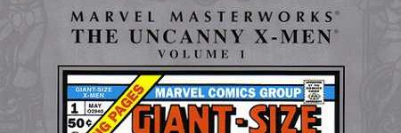

A user contacted me about adding [Marvel Masterworks: The Uncanny X-Men](https://metron.cloud/series/marvel-masterworks-the-uncanny-x-men-2003/) series to [Metron](https://metron.cloud) since we have recently added support for trade paperbacks/collected editions. I figured this would be useful exercise since it would show me what parts of the process could be improved to make it easier.

Currently, the process requires the editor to add ***all*** creators, characters, teams, etc. manually for the reprinted issues associate with the collection, much like a regular issue. One obvious way to simplify this is to automatically ***add*** any characters, team, story titles, etc. for the issues being reprinted. Currently, I've written an [admin action](https://github.com/bpepple/metron/blob/0d6268f92709ef886e49ffe2a134a0b6af3672f7/comicsdb/admin/issue.py#L145) to do this, but sometime in the future I need to expose this functionality so that ***anyone*** adding a Trade Paperback/Collection can save some time.

When I was creating Metron one of the choices I made was to add creators at an issue-level, and not at a story-level, since I wanted the process for adding an issue to be fairly simple. The downside to this approach is that adding information to a collection from an issue with multiple stories isn't really possible.😢