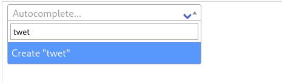

# January 2024 News

## Issues Indexed

The [Metron Project](https://metron.cloud/) had a total of **7,816** issues added to its database during January bring
the total number of issues to **106,500**. I wish to give big thanks to everyone who has helped with the project.
Thanks!

## Universes Support

[Universe](https://github.com/bpepple/metron/issues/173) support has been added to Metron, which will allow users to add
Publisher's universes to Issues, Characters, and Teams. I've used information from a variety of sources to populate the
initial universes, but I'm sure there is still a lot to be added.

To aid updating existing issues faster with this information I've created
a [Django Management Command](https://docs.djangoproject.com/en/5.0/howto/custom-management-commands/) to update a
series' issues. To make a request to update a series with Universe information, please provide the necessary
information in this [discussion page](https://github.com/bpepple/metron/discussions/208).

import UniverseImage from './universe-detail.png';

## Software Updates

New versions of [Mokkari](https://github.com/Metron-Project/mokkari)
and [Metron-Tagger](https://github.com/Metron-Project/metron-tagger) have been released, which primarily deal with
using [Pydantic](https://pydantic.dev/) and adding *Universe* support.

## Outstanding Bug Fixed

Fixed an outstanding [bug](https://github.com/bpepple/metron/pull/210) where regular users were not able to add a new
creator when adding a credit record to an Issue. Thanks to [THElegend5](https://github.com/THElegend5) for reporting
this bug!

