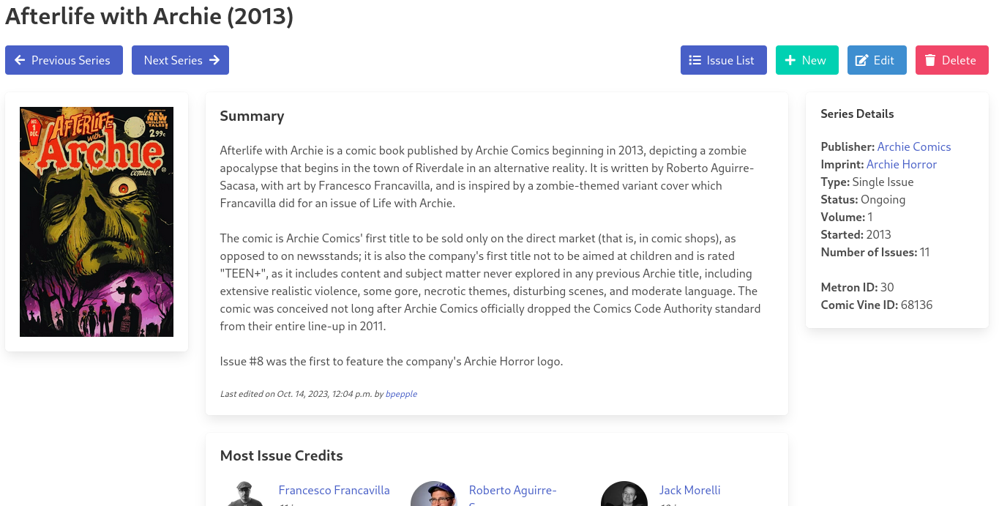

# Publisher Imprint Support

Spent the weekend working on *finally* adding support for Publisher's imprints. Before this, [Metron](https://metron.cloud/) simply lumped _Publishers_ and _Imprint_ together under the __Publisher__ views which was not ideal, but this change will allow them to be separated.

New views, filters, and API endpoints have been added for this feature, so if you see anything missing or behaving not as expected, please open a [bug report](https://github.com/bpepple/metron/issues).

In addition, I've released new version of [Darkseid](https://github.com/Metron-Project/darkseid/releases/tag/v4.1.2), [Mokarri](https://github.com/Metron-Project/mokkari/releases/tag/v3.3.0), and [Metron-Tagger](https://github.com/Metron-Project/metron-tagger/releases/tag/v2.5.0) that add support for imprints. And as always, if you discover any bugs, it would be appreciated if you opened a report in the appropriate git repository.

Anyway, that's all I got for now. Take care! 