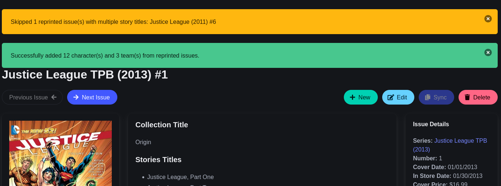

# September 2025 News

## Monthly Statistics

During September the [Metron Project](https://metron.cloud/) added the following to its database:

- Users: **27**
- Issues: **3,015**
- Creators: **371**
- Characters: **1,629**

Thanks to everyone that contributed!

## Metron-Tagger

A new [version](https://github.com/Metron-Project/metron-tagger/releases/tag/v4.4.0) of [Metron-Tagger](https://github.com/Metron-Project/metron-tagger) was released that added the ability to skip issues that have multiple matches (`--skip-multiple`) but can't be matched based its cover hash.

## Collected Editions

Back in [May](../2025-06-01-april-may-update/index.md#trade-paperbacks) the decision was made to temporarily disable new collections (Trade Paperback, Omnibus, and Hard Covers) until better documentation was written since their handling was a source of confusion for users due to our lack of documentation. 

Thankfully, `anon_hacker47` (from the [Matrix General Chat Room](https://matrix.to/#/#metrondb:matrix.org)) spent time writing new [documentation](https://metron.cloud/pages/guidelines/editing/) (located at the bottom of the page under the *Collected Editions* heading), which should help in most cases. Unfortunately, the comic industry isn't known for it's consistency, so there may be cases which the guidelines don't cover and in those cases it's best to ask either in the Matrix chat room or in the [Github Discussions](https://github.com/Metron-Project/metron/discussions) before adding a collected edition.

So, with that the documentation completed I've enabled support for collected editions on the site. In addition, I spent some time implementing a helper function which will add resource data (character & teams) to a collection provided that it has reprints associated with it. There are some caveats, tho:

- Only issues with a single story will be synced, since if there are more we can't differentiate what characters are in which story.
- Resource will be synced if the collection does not already have any characters or teams associated with it.
- I may add the reprinted issues story titles to the collection in the future, but need to look into it a bit closer to make sure it doesn't cause more work than it solves.

The `Sync` button, which is only active if it's a valid series type and doesn't contain *any* characters or teams, will be used to run this functionality. After it's ran, it will provide notification on what was or wasn't not added to the collection.

If you have suggestions on any improvements to the guidelines, don't hesitate to reach out on Matrix.

## OpenCollective

If you would like to help keep the lights on at the project, we have an account at
[Open Collective](https://opencollective.com/metron) to defray the servers costs and help with increasing future
server capacity.

Anyway, that's all I got for this month. Take care!