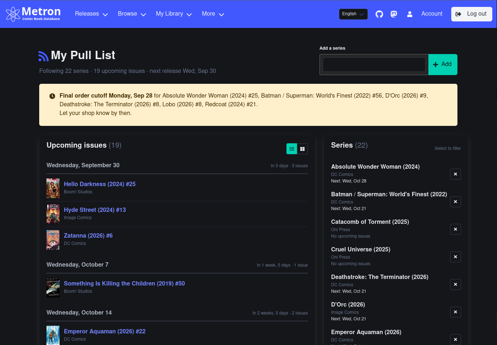

<!-- DRAFT: work in progress, being filled in as the month goes on. -->
During September the pull list page was redesigned around upcoming releases, the series list endpoint picked up new fields and a serializer consolidation, the API cache invalidation work from [last month](/blog/august-2026-update#api-response-caching) was extended to close its remaining staleness gaps, and a 500 error on invalid API lookups was fixed. The issue endpoint also gained a `cover_date_range` filter, a bug that dropped `Retry-After` from some 429 responses was fixed, and Mokkari shipped an opt-in rate-limiter pacing gate plus connection pooling. If you donate on Open Collective, please [don't contribute as Incognito](/blog/september-2026-update#dont-contribute-as-incognito); Metron can't link an Incognito contribution to your account. Here's everything that landed so far, plus the usual bug fixes and quality-of-life improvements.

<!-- truncate -->

## Monthly Statistics

<!-- TODO: fill in from production at end of month -->

During September the [Metron Project](https://metron.cloud/) added the following to its database:

- Users: **521**
- Issues: **3,386**
- Creators: **463**
- Characters: **987**
- Reading Lists: **20**

## Pull List Redesign

The [pull list](https://metron.cloud/pull-list/) page has been reworked into an upcoming-releases view. The header now summarizes how many series you follow, how many issues are coming up, and the date of the next release, with the **Add a series** search moved up alongside it.

**Upcoming issues grouped by release day.** Issues with a store date on or after today are grouped under their release day, each group showing a countdown ("Today", "In 5 days", "In 1 week, 5 days") and its issue count. A toggle at the top of the panel switches between a compact list and a grid of covers. Up to 50 upcoming issues are shown at a time.

**Final order cutoff warnings.** Comic shops need to place their orders before a publisher's final order cutoff (FOC). Any issue whose FOC falls within the next 7 days gets a yellow tag and is listed in a warning banner at the top of the page, grouped by cutoff date, so you can let your shop know in time. Issues with a later FOC show it as a blue tag instead. The banner, like the header counts, always covers your whole pull list, even while filtering.

**Series sidebar with filtering.** The series panel lists every series you follow along with the date of its next issue (or "No upcoming issues"). Selecting a series narrows the upcoming list to just that series; selecting it again, or clicking **Clear filter**, shows everything again. Filtering and switching views are handled with [HTMX](https://htmx.org/), so the page doesn't reload, and the URL updates so you can bookmark a filtered view.

**Remove with Undo.** Series are now removed inline with the **×** button — no more separate confirmation page — and a notification names the removed series with an **Undo** button in case you clicked the wrong one. Your current filter and view are kept across both removing and undoing.

**Dark mode fixes.** Several fixed-colour styles on the page were replaced with theme-aware equivalents, so the pull list now renders properly in dark mode. Italian translations were also updated for all the new strings.

## API Improvements

**Series list endpoint gains `publisher`, `series_type`, `cv_id`, and `gcd_id`.** `/api/series/` now returns all four fields. The publisher's `series_list` action briefly split off its own `PublisherSeriesListSerializer` to keep that response unchanged while `cv_id`/`gcd_id` were scoped to the top-level endpoint, then was consolidated back onto `SeriesListSerializer` once `publisher` made the two payloads equivalent.

**Pull list series endpoint kept unchanged.** The pull list series endpoint nests `SeriesListSerializer` directly, so adding `publisher`/`series_type` there leaked into its response too. A new `PullListSeriesInfoSerializer` pins that endpoint's fields back to the pre-existing set — also dropping `cv_id`/`gcd_id`, which were never exposed there either. That serializer also carried an `issue_count` field that was never actually populated for this endpoint (a read-only field DRF silently omits rather than erroring on), so it was removed rather than wired up.

**`cover_date_range` filter added to the issue API.** `/api/issue/` now accepts `cover_date_range_after`/`cover_date_range_before`, matching the existing `store_date_range`/`foc_date_range` filters.

## API Response Caching

**Closing remaining staleness gaps.** `Character.creators`/`teams`/`universes`, `Team.creators`/`universes`, and `Series.genres`/`associated` had no `m2m_changed` wiring at all, so adding or removing a relation didn't bump the owning object's own `modified` timestamp — not just cosmetic staleness, the object's own listed relations could be wrong until the cache TTL lapsed. The variant/universe/reprint Issue cascades now also bump the Issue list-cache version, for consistency with the credits/credit-role cascades already covering it.

**Universe and Team rename staleness.** `IssueViewSet` now tracks Universe renames (measured at a low ~180 historical saves site-wide — lower write volume than Publisher, which was already tracked), and `CharacterViewSet`/`TeamViewSet` now track Universe and Team renames too (~3.1k saves for Team). Creator-driven staleness on Character/Team/Issue, and Genre-driven staleness on Series, are accepted as-is — Creator's write volume (~17.8k-18.6k saves) is roughly 100x Universe's and risks reproducing the cache-thrashing regression already fixed for Series, while Genre names are effectively static. Issue rating changes also intentionally continue to skip Issue cache invalidation, since ratings churn far more than any other field on popular issues.

**Detail cache TTL raised to 96h.** The safety-net TTL for cached detail responses — self-invalidating on write regardless of TTL — went from 48h to 72h and then to 96h this month. Cache effectiveness can now also be read straight from production logs: gunicorn's access log gained a `cache=` field carrying the same `X-Cache` HIT/MISS status the API response already sets, and [DEPLOYMENT.md](https://github.com/Metron-Project/metron/blob/master/DEPLOYMENT.md) documents computing a day's hit rate from it, with a variant that excludes list endpoints since their short TTL skews the raw rate toward MISS.

## Bug Fixes

**500 error on invalid API detail lookups.** `get_object_modified()` filtered the queryset directly with the raw URL kwarg for its cheap `(pk, modified)` lookup, bypassing the exception handling DRF's `get_object_or_404()` normally provides. A non-numeric value against an integer lookup field (e.g. `/api/series/does-not-exist-9999/`) raised an uncaught `ValueError` instead of a 404.

**Wikipedia attribution license bumped to 4.0.** The attribution footer still linked to Creative Commons Attribution-Share-Alike License 3.0, after Wikipedia's own switch to 4.0.

**Missing cover images instead of the placeholder.** `sorl-thumbnail` returns a sizeless placeholder object (not `None`) when an image field references a file missing from S3, which raised a `TypeError` as soon as a template read its width. `sorl` already recovers from that via the thumbnail tag's `` clause, but none of Metron's templates defined one, so covers silently vanished instead of falling back to the existing "image not found" graphic.

**Missing `Retry-After` on some 429 responses.** DRF's throttle `wait()` returns `None` once a user already has more requests in the current window than the (possibly just-lowered) limit allows, and the exception handler only set `Retry-After` when `wait()` was truthy — so those 429s went out with no `Retry-After` at all. The accompanying `X-RateLimit-*-Reset` headers were also wrong in that case: they reported when only the oldest request expires, rather than when enough of them expire to actually free a slot, so a client that waited until Reset could be rejected again. Both are now computed from the same corrected calculation.

## Developer Experience

**Fixed `.env.example` missing required settings.** `settings.py` reads `STATIC_ROOT` and `MEDIA_ROOT` through `config()` with no default whenever `DEBUG` is on, and the example file sets `DEBUG=True` — so copying it as-is raised `UndefinedValueError` on `manage.py` before anything else could run. Both variables are now declared, and `staticfiles/`/`media/` were added to `.gitignore`.

**Upgraded to Django 6.1.1.** Email settings were also migrated ahead of Django 7.0: the deprecated `EMAIL_*` settings are replaced by `settings.MAILERS`, and mail-sending call sites moved off the deprecated `get_connection()`/`EmailMessage(connection=...)` API onto `mail.mailers.default` and `send(using="default")`, clearing the `RemovedInDjango70Warning` the old API raised throughout the test suite.

**Retired the nginx-429 fail2ban jail.** The jail had already been disabled on the server since the `notify_throttled_clients` management command took over — its 429 counts from the logs now feed the throttle-notice e-mails instead.

## Tooling Releases

### Mokkari 4.8.0

- **4.7.0** - Adds `publisher`, `series_type`, `cv_id`, and `gcd_id` to the series schema, and `issue_count` to `PullListSeriesDetail`, matching the [series list endpoint changes](#api-improvements) above. Bumps pyright to target Python 3.14. Upgrades the ESLint toolchain to v10, removing unused dead dependencies and swapping the unmaintained `eslint-plugin-eslint-comments` for the maintained `@eslint-community` fork.
- **4.7.1** - Drops `issue_count` from `PullListSeriesDetail` again, matching Metron [dropping it from the pull_list endpoint's response](#api-improvements) once it turned out nothing ever populated it.
- **4.8.0** - Adds an opt-in `rate_limiter` pacing gate to `Session`: a `RateLimiter` protocol a caller can implement to block until capacity frees, plus `HeaderPacedRateLimiter`, a reference implementation that paces requests from Metron's `X-RateLimit-*` headers instead of `Session`'s default fail-fast check — raising on an exhausted daily window rather than silently blocking for hours. Bounds pagination's 429 retries so a sustained rate limit (or a non-blocking custom limiter) can no longer hang a list call forever, now that Metron always sends `Retry-After` on a 429 ([above](#bug-fixes)). Reuses a single pooled `requests.Session` instead of paying a fresh TCP+TLS handshake per request.

## For App Developers: Don't Run Every Install at the Same Time

If you maintain an application that other people install and run, and it talks to Metron on a schedule, please don't have every install run its scheduled jobs at the same time. Personal scripts are fine; this is about software that many people run.

This has happened more than once. The traffic from a third-party app shows up as a sharp spike at the same time every day, or every hour, because every install of that app is running the same job at the same moment. The time varies from app to app: sometimes it's midnight UTC, sometimes the top of the hour, and sometimes whatever time the app ships as its default.

Often nothing in the app's code sets that time directly. In the most recent case, the app used a job queue with a "repeat every 24 hours" option, and that queue lines interval jobs up with the Unix epoch instead of the time the server started. Every install with the default 24-hour interval therefore ran at exactly 00:00 UTC, no matter where it was or when it was started.

Each install stays inside its own rate limit, but they all hit the same server at once. When that happens, responses slow down for everyone, including people using the site at that time.

A few ways to avoid it:

- **Pick a random offset once per install and save it.** For example, choose a random minute and hour on first run, store it in the app's settings, and use it to build the cron expression or pass it as the scheduler's offset. Each install still runs once a day, but the installs are spread across the whole day.
- **Check how your scheduler works out "every N hours".** Some schedulers count from when the job was registered. Others, like BullMQ's `repeat.every`, line up with the epoch. Cron patterns like `0 0 * * *` or `@daily` always run at the same wall-clock time on every machine.
- **Don't ship a fixed time as the default.** Most users never change the default, so whatever time you ship, whether it's midnight, 3 AM, or the top of the hour, is the time nearly every install uses.
- **Add jitter to retries as well.** If every install retries after a failure with the same fixed delay, they'll all come back at the same moment too.
- **Only fetch what you need.** Filter by the series the user actually follows (for example with `series_id`) instead of pulling every upcoming issue and filtering locally. It cuts the number of requests for both you and us.
- **Respect the rate limit headers.** Honor `Retry-After` on a 429, and use the `X-RateLimit-*` headers to pace your requests. If you're using Mokkari, 4.8.0's [`HeaderPacedRateLimiter`](#mokkari-480) does this for you.

If you're not sure whether your app is affected, feel free to ask on [Matrix](https://matrix.to/#/#metron-general:matrix.org) and we'll help check.

## OpenCollective

A huge thank you to everyone who has contributed to our [Open Collective](https://opencollective.com/metron)! Your support makes a real difference in keeping the Metron Project running and growing.

### What Your Contributions Support

Funds from Open Collective go directly toward:

- **Server hosting costs** - Keeping the Metron website and API available
- **Domain registration** - Annual domain name renewals
- **Future capacity increases** - Scaling resources as the database and user base grows

All expenses are transparent and publicly viewable on our [Open Collective page](https://opencollective.com/metron), so you can see exactly where every dollar goes.

### Support the Project

As covered in our [supporter rate limits post](/blog/supporter-rate-limits), donors now automatically get an elevated daily API rate limit. Any contribution, at any tier, genuinely helps keep Metron free for the whole community.

### Don't Contribute as Incognito

When you contribute on Open Collective, you can choose to contribute as **Incognito**. Please don't use that option if you want the [supporter rate limit](/blog/supporter-rate-limits).

Metron matches each contribution to an account by the contributor's email address. Open Collective doesn't share an Incognito contributor's email, so Metron has nothing to match, and the elevated rate limit is never applied to your account. This applies to recurring donations as well: every monthly charge from an Incognito contribution is skipped the same way.

When you contribute, use your normal profile and the same email address that's confirmed on your Metron account. Your email isn't shown publicly on Open Collective either way.

If you've already contributed as Incognito and your profile page doesn't show a supporter tier, [e-mail me](mailto:bpepple@metron.cloud) with your Open Collective order number and I'll apply it by hand.

---

Thanks to everyone who contributed issues, pull requests, and feedback this month. As always, the project is open source and community contributions are welcome.
